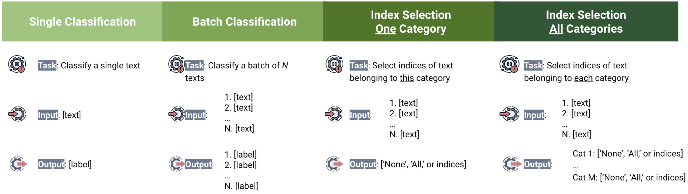
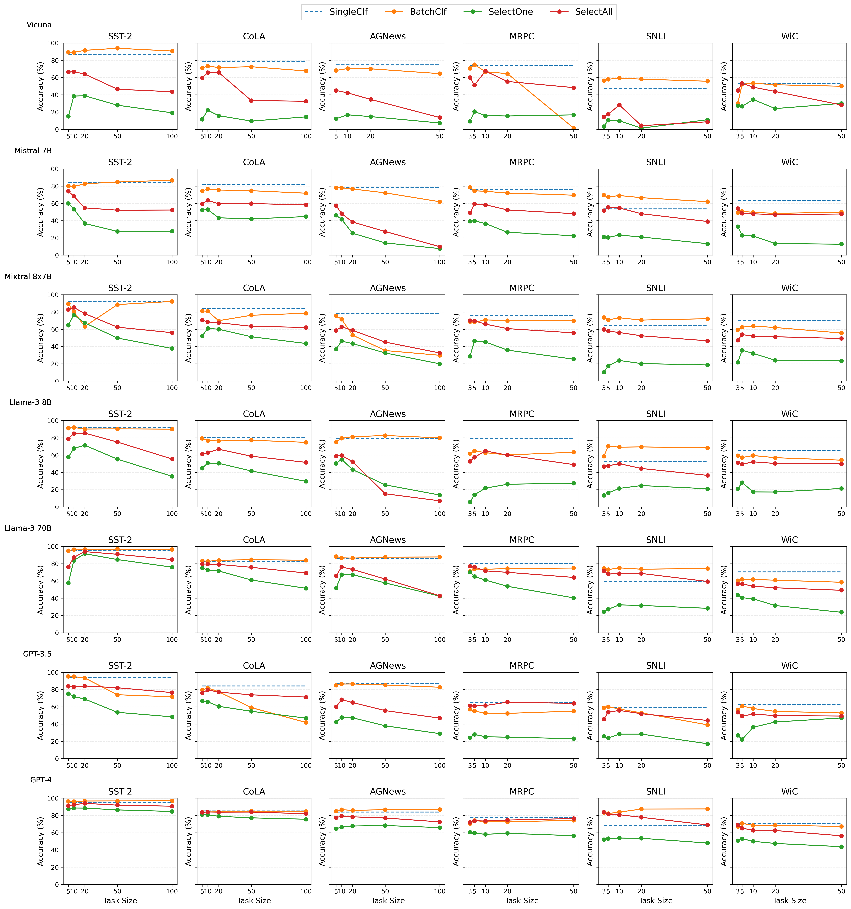

## Evaluating LLMs with Multiple Problems at once: A New Paradigm for Probing LLM Capabilities

Current LLM evaluation predominantly performs evaluation with prompts comprising single problems, i.e., **single-problem evaluation**. We propose **multi-problem evaluation** as an additional approach to study the multiple problem handling capabilities of LLMs. We present a systematic study in this regard by comprehensively examining 7 LLMs on 4 related types of tasks (see the figure below) constructed from 6 classification benchmarks. 

<p align='center'>
 
</p>


The preprint is available in [arXiv](https://arxiv.org/pdf/2406.10786). 


## Main findings

Our main findings are largely consistent across LLMs and benchmarks we tested under <ins>zero-shot, few-shot, 1-shot-CoT</ins> evaluations settings as  well as on a novel benchmark we created. 


#### LLMs are competent multi-problem solvers

- They generally perform (nearly) as well on multi-problem tasks as on single-problem tasks;
- Contrary to common expectation, they often do not suffer from a positional bias with long inputs;
- And as a result, **multi-problem prompting** is a simple and cost-efficient prompting method of practical significance. 
  - For example, we can <ins>save up to 82% inference cost of GPT-4 per problem</ins> with multi-problem prompting in our experiments.


#### Neverthelss, LLMs may lack true understanding

- They do not solve multiple problems equally well when presented in a different form;
  - They perform significantly worse in selecting indices of text falling into each label, either independently or altogether, than in making multiple classifications at once directly, even when there are only 3 or 5 problems to solve

- They perform index selection <ins>significantly better</ins> when asked to select text indcies for each label <ins>all at once than one at a time separately</ins>;
  - because LLMs are less likely to produce illogical index assignments when they have to produce their answers in a single output than multiple separate outputs, which highlights the probablistic aspect of LLM answer generation.
- But with a follow-up experiment, we show that they can indeed do index selection in general and the performance gap between the two index selection tasks also disappears.

<p align='center'>
 
</p>


## Towards multi-problem evaluation

Evaluation in a multi-problem setting has several advantages over typical single-problem evaluation.

- **Mitigating the data contamination concern**: it is less likely for LLMs to encounter exact long multi-problem prompts during pre-training because of the combinatory nature of constructing prompts from multiple problems. 
- **A well controlled and easily interpretable evaluation**: we can manipulate <ins>what kind of problems and how many problems</ins> to include, we know exactly which problem a LLM gets wrong or right across positions in the prompts. 
- **An easily adaptable evaluation framework**: leveraging the rich existing benchmarks to create a new multi-problem task is <ins>cheap, easy to implement, and highly adaptable</ins>. 


## Code, data, prompt templates, and results 

- The scripts in the [`scripts`](./scripts) folder contain code for generating prompts for the 4 task types, making LLM API calls, parsing LLM outputs, and evaluating the obtained results. 
- The file [`data.zip`](./data.zip) provides the original benchmarks we use to generate prompts for the 4 task types. Notebooks inside the [promptsCreation](./notebooks/promptsCreation) folder under `notebooks` document the prompt templates we use in the main text of the paper and the prompt generation process based on each benchmark. Due to random sampling, if we re-ran the notebooks inside the [promptsCreation](./notebooks/promptsCreation) folder, it is unlikely that you will get exactly the same prompts we have.  
- **We thus provide the full results we obtained for reproducibility**. Simply git clone this repo, download [this zip file stored in Google Drive]((https://drive.google.com/file/d/1srhITYILfjwfgb9kpEwlUHvTAAoP0PqD/view?usp=drive_link)) and place the unzipped folder in the cloned repo, and run [`reproduce_results.ipynb`](./notebooks/analyses/reproduce_results.ipynb). 


## Conducting a new multi-problem evaluation?

Here is a recommended workflow to conduct a new multi-problem evaluation on **other classification benchmarks** of your choice. 

- Step 1: design a prompt template that is suitable for the chosen classification benchmark and generate prompts for the 4 task types. Take a look at the notebooks inside [promptsCreation](./notebooks/promptsCreation). This step is easier than you think!
-  Step 2: run LLMs of your choice on the generated prompts. You may use the command line tool [`run_clf_experiments.py`](./run_clf_experiments.py) provided here.
- Setp 3: parse and evaluate LLM outputs. Please note that [the parsing code](./scripts/parsing.py) in this repo is very specific to the LLMs and benchmarks we used. You may want to come up with new rules or use a different parsing method (e.g., using LLMs) to parse your LLM outputs. You can reuse our code in [`evaluate.py`](./scripts/evaluate.py) to format your results as we do.
- Step 4: analysis. E.g., [`reproduce_results.ipynb`](./notebooks/analyses/reproduce_results.ipynb)!


## Citation

``````
@misc{wang2024evaluatingllmsmultipleproblems,
      title={Evaluating LLMs with Multiple Problems at once: A New Paradigm for Probing LLM Capabilities}, 
      author={Zhengxiang Wang and Jordan Kodner and Owen Rambow},
      year={2024},
      eprint={2406.10786},
      archivePrefix={arXiv},
      primaryClass={cs.AI},
      url={https://arxiv.org/abs/2406.10786}, 
}
``````
